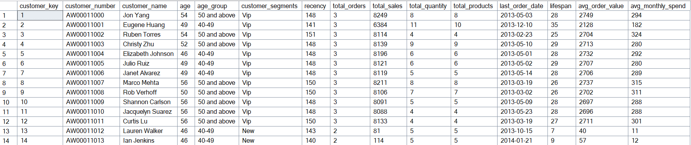
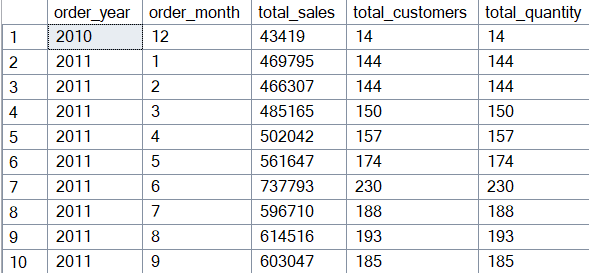
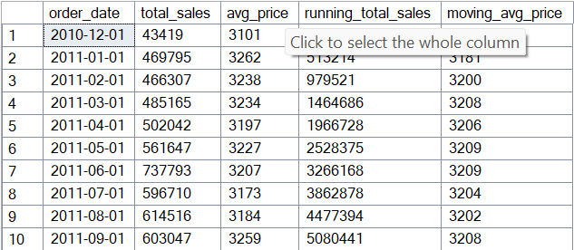
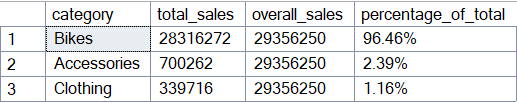
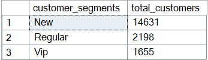

# 📊 Customer & Business Data Analytics

This project applies data analytics techniques to uncover insights and create reports that support decision-making.

The goal of this project is to analyze business/customer data using different analytical approaches and present findings through clear reports. The analysis covers time-based trends, performance tracking, segmentation, and part-to-whole relationships.



---

## 🚀 Analysis Performed

### Change Over Time Analysis

To identify the total sales by each month in a year:

```sql
USE CustomerBusinessAnalytics;
GO

SELECT
YEAR(order_date) as order_year, 
MONTH(order_date) as order_month,
SUM(sales_amount) as total_sales, 
COUNT(DISTINCT customer_key) as total_customers,
SUM(quantity) as total_quantity
FROM DataAnalytics.dbo.sales
WHERE order_date IS NOT NULL
GROUP BY YEAR(order_date), MONTH(order_date)
ORDER BY YEAR(order_date), MONTH(order_date)
```



Total sales showed a steady increase during the first half of 2011, peaking in June before declining in the latter half of the year.

### Cumulative Analysis

To calculate the total sales per month and the running total of sales over time:

```sql
SELECT
order_date,
total_sales,
avg_price,
SUM(total_sales) OVER (ORDER BY order_date) AS running_total_sales,
AVG(avg_price) OVER (ORDER BY order_date) AS moving_avg_price
-- window function
FROM
(
SELECT DATETRUNC(month, order_date) AS order_date, 
SUM(sales_amount) as total_sales,
AVG(price) as avg_price
FROM DataAnalytics.dbo.sales
WHERE order_date IS NOT NULL
GROUP BY DATETRUNC(month, order_date)
) t
```



The running total sales exhibited a consistent upward trend throughout 2011, indicating steady growth over the year.

### Part-to-Whole Analysis

To identify which category contribute the most to the overall sales:

```sql
WITH category_sales AS (
SELECT 
category,
SUM(sales_amount) as total_sales
FROM DataAnalytics.dbo.sales s
LEFT JOIN DataAnalytics.dbo.products p
On p.product_key = s.product_key
GROUP BY category
)
SELECT 
category,
total_sales,
SUM(total_sales) OVER () as overall_sales,
CONCAT(ROUND((CAST(total_sales AS FLOAT) / SUM(total_sales) OVER ()) * 100, 2), '%') AS percentage_of_total
FROM category_sales
ORDER BY total_sales DESC
```



With bikes contributing 96% of total sales, the business appears heavily dependent on this category, highlighting a possible need for diversification

### Data Segmentation

Group customers into three segments based on their spending behaviour, and find the total number of customers by each group:

```sql
WITH customer_spending AS(
SELECT
c.customer_key,
SUM(s.sales_amount) AS total_spending,

-- lifespan = last_oreder - first_order
MIN(order_date) AS first_order,
MAX(order_date) AS last_order,
DATEDIFF(month, MIN(order_date), MAX(order_date)) AS lifespan
FROM DataAnalytics.dbo.sales s
LEFT JOIN DataAnalytics.dbo.customers c
ON s.customer_key = c.customer_key
GROUP BY c.customer_key
)

SELECT 
customer_segments,
COUNT(customer_key) AS total_customers
FROM (
	SELECT
	customer_key,
	total_spending,
	lifespan,
	CASE WHEN lifespan >= 12 AND total_spending > 5000 THEN 'Vip'
		 WHEN lifespan >= 12 AND total_spending <= 5000 THEN 'Regular'
		 ELSE 'New'
	END customer_segments
	FROM customer_spending ) t
GROUP BY customer_segments
ORDER BY total_customers DESC
```



New customers made up the largest segment, surpassing both regular and VIP customers, indicating strong acquisition but limited retention or premium engagement.

